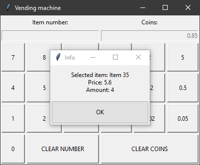

## Automat
Automat is a vending machine program written for a university class. The exact requierements for this project (in Polish) can be found [here](description/opis_automat_sprzedający_napoje.md).

Available items have numbers in range from 30 to 50. In order to check item info type its number in the left panel. To buy the item insert money into the machine using the right panel and enter the item number again.

### Running the program
In order to run the program you need to have python installed. It was tested using Python 3.8 and this is the recommended version.

Start by cloning the repository and entering its folder from command line. Run the program on Windows using `python application.py` command and use `python3 application.py` command to run it on Linux.

### Testing the program
Unit tests for Windows and Linux can be executed using `run_tests.bat` and `run_tests.sh` scripts respectively.